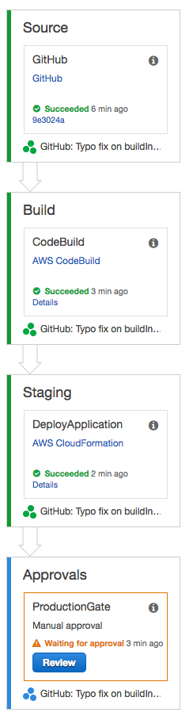

# Application
A lambda application written in java.

## Build
```
./gradlew clean build
```

## Run local
```
./gradlew run
```


# Deployment Pipeline for a Serverless Application




Services Used:
 
 * [AWS CodePipeline](https://aws.amazon.com/codepipeline/) for pipeline creation.
 * [AWS CodeBuild](https://aws.amazon.com/codebuild/) for testing and building your Go application(s).
 * [AWS CloudFormation](https://aws.amazon.com/cloudformation/) for deploying infrastructure (Infrastructure-as-Code).


# Installation 

1. Clone repo into www.github.com
2. Create a personal access token (OAuth2 token) with 'repo' and 'admin:repo_hook' permissions here https://github.com/settings/tokens. 
3. Log into AWS Console 
4. Under Cloudformation, create stack by choosing a template and uploading it to Amazon S3. The cloudformation template is located in /aws/pipeline/cloudformation.yml
5. Fill out the cloudformation create stack form with your details
